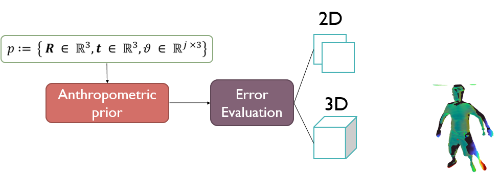

# Objective Function

The **objective function** of each experiment is a weighted linear combination of five individual error terms:
<!--
$$
E(\mathbf{p})= \lambda_J E_J(\mathbf{p}) + \lambda_D E_D(\mathbf{p}) + \lambda_S E_S(\mathbf{p}) + \lambda_P E_P(\mathbf{p}) +\lambda_A E_A(\mathbf{p}),
$$
-->

<!-- $\mathbf{p}$-->
where  denote the unknown variables, which in our case are the pose parameters that animate the template mesh into a specific pose in order to fit into the current live data.
The different error terms are:
- an extrapolated 3D Chamfer distance metric, 
- a surface alignment matching term, 
- a penalization term of mesh self-intersections, 
- the 2D projective silhouette error, 
- an anthropometric penalization of unnatural human poses, 

These can be categorized with respect to their domain:

|    |            |  Pose |
|:----------:|:-------------:|:------:|
| Chamfer distance () <!-- $E_D$ --> |  Silhouette error () <!-- $E_J$ --> | Anthropometric prior () <!-- $E_A$ --> |
| Surface alignment() <!-- $E_S$ --> |       |    |
| Self-penetration error () <!-- $E_P$ --> |  |     |

<!--
Three of these are defined in the three-dimensional space:
- an extrapolated 3D Chamfer distance metric, 
- a surface alignment matching term, 
- a penalization term of mesh self-intersections, 

One in the two-dimensional space:
- the 2D projective silhouette error, 

And a regularization term for the unknown variables (pose parameters):
- an anthropometric penalization of unnatural human poses, 
-->

<!--
From a data-fitting perspective, the **data terms** are:
- the Chamfer distance,  
- surface alignment, , and,
- silhouette error, ,
-->

<!--
while the **constraints** are provided by:
- the self-penetration term, , and,
- the anthropometric prior term, 
-->
or a data fitting perspective:

| **Data Terms**   |      **Constraints**      |
|:----------:|:-------------:|
| Chamfer distance () <!-- $E_D$ --> |  Self-penetration error () <!-- $E_P$ --> |
| Surface alignment () <!-- $E_S$ --> |    Anthropometric prior () <!-- $E_A$ -->   |
| Silhouette error () <!-- $E_J$ --> |  |

Our complete objective as formulated above is a linear weighted combination of these terms as weighted by the respective weights  <!-- $\lambda$ -->. More details can be found in __\[[10](#Perfcap)\]__.

Each pose parameter vector , corresponds to a global root rotation  and translation , as well as per joint  rotation parameters  for all joints ,parameterized by their exponential map __\[[1](#ExpMap)\]__.
All template meshes are automatically skinned and rigged with __\[[2](#Pinocchio)\]__.
By animating the rigged and skinned template with the pose parameters  we get a re-posed mesh of the template , with  and  the template's vertices and normals respectively (connectivity, _i.e._ triangles/faces remain consistent).
For animation we use dual quaternion skinning (DQS) __\[[3](#DQS)\]__.

Four error functions are formulated indirectly to the optimized variables through the animated mesh, while the anthropometric prior  is calculated solely on the pose parameters .

Regarding the former, we first calculate the Euclidean Distance Transform (EDT) using a separable Chamfer implementation __\[[4](#Chamfer)\]__ defined on a voxel grid  whose bounding box is tightly calculated using the input live data.
Thus our  error terms are defined:

- 

    
    where a sampling operation  defined on the EDT grid, samples the distance at each animated vertex , clamped within the confines of the bounding box that the EDT was calculated in through .
    Given that pose parameters  may be explored outside the bounding box that the EDT is defined in, we further supplement the sampled distance, with an approximate distance that is negligible within the bounding box, but allows the error to extrapolate outside its bounds and offer meaningful evaluations.

- 

    which represents a surface alignment error using the gradient of the distance field and the animated template's surface normals.

<a name="ExpMap"/>__[1]__ Grassia, F. S. (1998). Practical parameterization of rotations using the exponential map. Journal of graphics tools, 3(3), 29-48.

<a name="Pinocchio"/>__[2]__ Baran, I., & Popović, J. (2007). Automatic rigging and animation of 3d characters. ACM Transactions on graphics (TOG), 26(3), 72-es.

<a name="DQS"/>__[3]__ Kavan, L., Collins, S., Žára, J., & O'Sullivan, C. (2007, April). Skinning with dual quaternions. In Proceedings of the 2007 symposium on Interactive 3D graphics and games (pp. 39-46).

<a name="Chamfer"/>__[4]__ Coeurjolly, D., & Montanvert, A. (2007). Optimal separable algorithms to compute the reverse euclidean distance transformation and discrete medial axis in arbitrary dimension. IEEE transactions on pattern analysis and machine intelligence, 29(3), 437-448.

<a name="Perfcap"/>__[10]__ To appear.