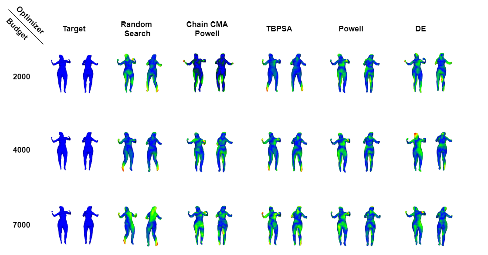
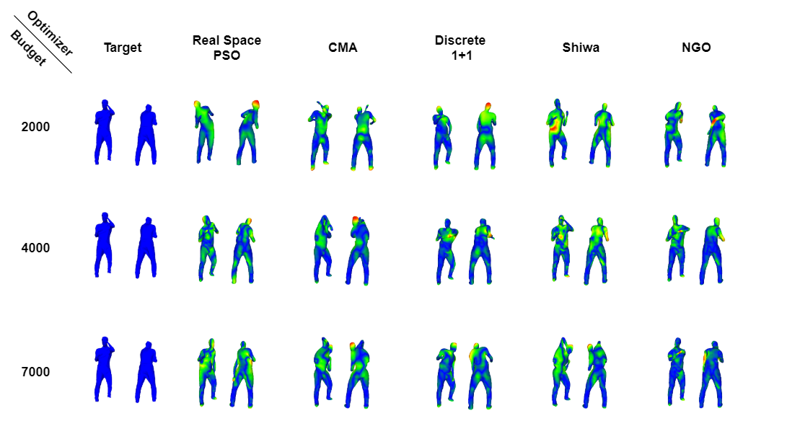
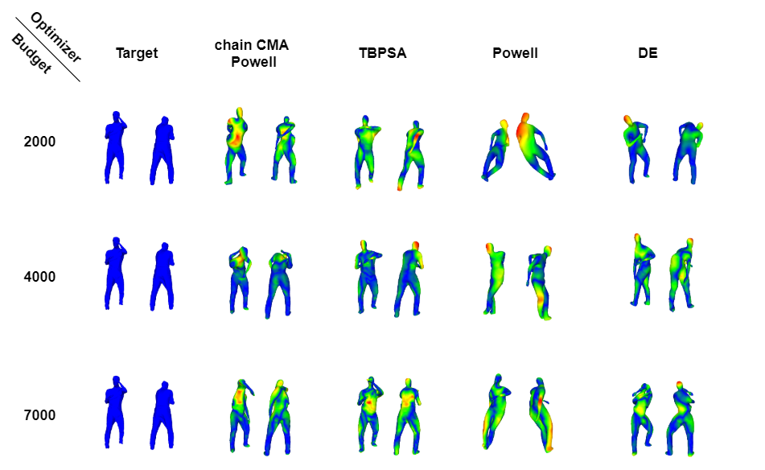

# Convergence Error Visualization

# Optimizer Exploration Evolution

Synchronized results across iterations between different optimizers starting from the same initial pose pose.
Apart from visualizing each optimizer's evolution and search strategy, the animated mesh illustrates the Chamfer distance using a turbo colormap on each vertex.

Results for the following sequences are available:
- [Alex](qual_optim_alex.md)
- [Manos#1](qual_optim_manos1.md)
- [Manos#2](qual_optim_manos2.md)

<!--
# Visualized Error on the Converged Poses
Fitting results upon convergence of each optimizer with a dense error metric denoted using the heatmap overlayed at each animated mesh vertex.

## Local Experiments
- **Project#2**

## Global Experiments
- **Project#4**

More Projects Coming Soon 
{: .label .label-purple }

# Optimizer Exploration Evolution
Optimizer evolution visual comparison between the different optimizers with the Chamfer distance visualized through a turbo colormap.

- **Project#2**

    | CMA   |      DE      |  Powell |
    |:----------:|:-------------:|:-------------:|
    |  |  |  |

    | CMA+Powell | DiscreteOnePlusOne | NGO |
    |:----------:|:-------------:|:-------------:|
    |  |  |  |

    | TBPSA | RealSpacePSO |Shiwa |
    |:----------:|:-------------:|:-------------:|
    |  |  |  |

- **Project#8**

    | CMA   |      DE      |  Powell |
    |:----------:|:-------------:|:-------------:|
    |  |  |  |

    | CMA+Powell | DiscreteOnePlusOne | NGO |
    |:----------:|:-------------:|:-------------:|
    |  |  |  |

    | TBPSA | RealSpacePSO |Shiwa |
    |:----------:|:-------------:|:-------------:|
    |  |  |  |

- **Project#10**

    | CMA   |      DE      |  Powell |
    |:----------:|:-------------:|:-------------:|
    |  |  |  |

    | CMA+Powell | DiscreteOnePlusOne | NGO |
    |:----------:|:-------------:|:-------------:|
    |  |  |  |

    | TBPSA | RealSpacePSO | Shiwa |
    |:----------:|:-------------:|:-------------:|
    |  |  |  |

More Projects Coming Soon 
{: .label .label-purple }
-->