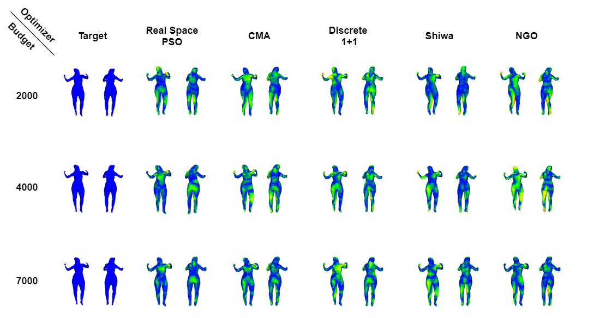
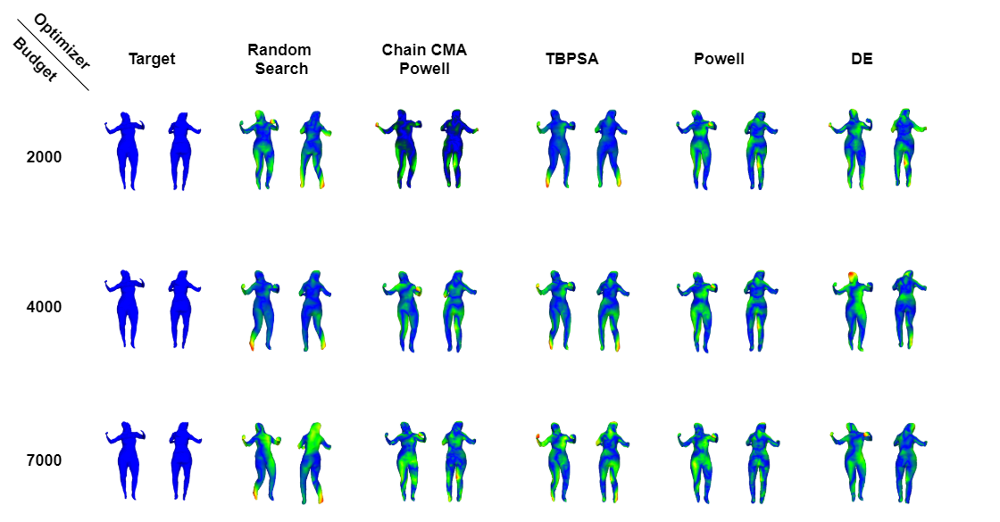

# Quantitative Results

## Nevergrad Experiments

| Experiment#1   |      Experiment#2      |  Experiment#3 |
|:----------:|:-------------:|:-------------:|
|  |  |  |

| Experiment#4 | Experiment#5 | Experiment#6 |
|:----------:|:-------------:|:-------------:|
|  |  |  |

| Experiment#7 | Experiment#8 |Experiment#9 |
|:----------:|:-------------:|:-------------:|
|  |  |  |

| Experiment#10 | Experiment#11 | |
|:----------:|:-------------:|:-------------:|
|  |  | |

| Experiment#1   |      Experiment#2      |  Experiment#3 |
|:----------:|:-------------:|:-------------:|
|  |  |  |

| Experiment#4 | Experiment#5 | Experiment#6 |
|:----------:|:-------------:|:-------------:|
|  |  |  |

| Experiment#7 | Experiment#8 |Experiment#9 |
|:----------:|:-------------:|:-------------:|
|  |  |  |

| Experiment#10 | Experiment#11 | |
|:----------:|:-------------:|:-------------:|
|  |  | |

## Optimizer Evaluation

|      Optimizer     | Experiment 1 | Experiment 2 | Experiment 3 | Experiment 4 | Experiment 5 | Experiment 6 | Experiment 7 | Experiment 8 | Experiment 9 | Experiment 10 | Experiment 11 |   Average   |
|:------------------:|:------------:|:------------:|:------------:|:------------:|:------------:|:------------:|:------------:|:------------:|:------------:|:-------------:|:-------------:|:-----------:|
|   chainCMAPowell   |   0.0724336  |   0.0672766  |   0.0675464  |   0.0639084  |   0.1030412  |   0.1079386  |   0.117855   |   0.0596122  |   0.063053   |    0.546589   |   0.1624202   |  0.1301522  |
|         CMA        |   0.0911692  |   0.062868   |   0.074295   |   0.0638098  |   0.1051516  |   0.1045234  |   0.0953772  |   0.0605216  |   0.0594324  |   0.5387744   |   0.0566894   | 0.119328364 |
|         DE         |   0.1174608  |   0.0937956  |   0.1218546  |   0.0845802  |   0.1194798  |   0.123284   |   0.1510724  |   0.0777086  |   0.0902226  |   0.5370548   |   0.1063716   |   0.147535  |
| DiscreteOnePlusOne |   0.069234   |   0.0574614  |   0.105967   |   0.0771348  |   0.1106782  |   0.112026   |   0.1106452  |   0.0511622  |   0.0564046  |   0.5333806   |   0.0761212   | 0.123655927 |
|         NGO        |   0.0684556  |   0.0644676  |   0.0678344  |   0.0614018  |   0.0962354  |   0.1132592  |   0.1142464  |   0.0564634  |   0.0557566  |   0.5425878   |   0.0631132   | 0.118529218 |
|       Powell       |   0.0681324  |   0.059441   |   0.120547   |   0.072271   |   0.107089   |   0.106975   |   0.0909236  |   0.0535914  |   0.0565156  |    0.540221   |   0.0752414   | 0.122813491 |
|    RandomSearch    |   0.1691956  |   0.1889298  |   0.1731304  |   0.143578   |   0.1923638  |   0.165337   |   0.2072466  |   0.1373134  |   0.159975   |   0.4813262   |   0.1394988   | 0.196172236 |
|    RealSpacePSO    |   0.0900802  |   0.062368   |   0.0692706  |   0.0557102  |   0.106084   |   0.1134556  |   0.1024502  |   0.0574036  |   0.0646598  |   0.5358488   |   0.0575894   | 0.119538218 |
|        Shiwa       |   0.074594   |   0.0602958  |   0.0742208  |   0.1151622  |   0.101695   |   0.1086356  |   0.103481   |    0.05109   |   0.0668824  |    0.546559   |   0.1833744   | 0.135090018 |
|        TBPSA       |   0.136792   |   0.0817796  |   0.1394262  |   0.1334024  |   0.1548958  |   0.1423274  |   0.147837   |   0.0786588  |   0.1028986  |   0.4793322   |   0.1560274   | 0.159397945 |

|      Optimizer     | Experiment 1 | Experiment 2 | Experiment 3 | Experiment 4 | Experiment 5 | Experiment 6 | Experiment 7 | Experiment 8 | Experiment 9 | Experiment 10 | Experiment 11 |   Average   |
|:------------------:|:------------:|:------------:|:------------:|:------------:|:------------:|:------------:|:------------:|:------------:|:------------:|:-------------:|:-------------:|:-----------:|
|   chainCMAPowell   |  0.03005091  |  0.032860435 |  0.033697163 |  0.029372694 |  0.032697009 |  0.027373593 |  0.038265084 |  0.025222044 |  0.029795447 |  0.046894385  |  0.036503023  | 0.032975617 |
|         CMA        |  0.027974883 |  0.027305983 |  0.032485865 |  0.026055774 |  0.031286074 |  0.024607294 |  0.033187973 |  0.023339747 |  0.027279522 |  0.044915026  |  0.028308075  | 0.029704202 |
|         DE         |  0.050709394 |  0.044069588 |  0.064478826 |  0.042255676 |  0.048016047 |  0.041784488 |  0.050930477 |  0.03599406  |  0.040248565 |  0.053122074  |  0.045266358  | 0.046988687 |
| DiscreteOnePlusOne |  0.031154246 |  0.028731728 |  0.050716353 |  0.030833819 |  0.03197141  |  0.028069598 |  0.036798789 |  0.021856009 |  0.028609374 |  0.043465894  |  0.030881741  | 0.033008087 |
|         NGO        |  0.02893226  |  0.030856144 |  0.036799622 |  0.028842288 |  0.032763347 |  0.026898743 |  0.039294621 |  0.02452022  |  0.028338952 |  0.044408531  |  0.031775586  | 0.032130029 |
|       Powell       |  0.026624526 |  0.027483582 |  0.057879191 |  0.030058885 |  0.031916212 |  0.029975103 |  0.039116111 |  0.022498073 |  0.028863262 |  0.047237909  |  0.029480917  | 0.033739434 |
|    RandomSearch    |  0.088450515 |  0.084364988 |  0.084137376 |  0.073059696 |  0.075539094 |  0.067152652 |  0.077407405 |  0.058136344 |  0.064862259 |  0.076059411  |  0.064058029  | 0.073929797 |
|    RealSpacePSO    |  0.02974394  |  0.026110691 |  0.032918811 |  0.026582084 |  0.031092976 |  0.023749758 |  0.034467898 |  0.022177071 |  0.027694323 |  0.043718564  |  0.028725434  | 0.029725595 |
|        Shiwa       |  0.029989107 |  0.030442139 |  0.035854152 |  0.031325774 |  0.032663181 |  0.026518686 |  0.037352712 |  0.024697134 |  0.031306676 |  0.042707948  |  0.039220132  | 0.032916149 |
|        TBPSA       |  0.064344674 |  0.043877142 |  0.069670507 |  0.059741623 |  0.054157782 |  0.050795536 |  0.061386211 |  0.026785022 |  0.045028812 |  0.067978396  |  0.053731953  | 0.054317969 |

| Experiment#1   |      Experiment#2      |
|:----------:|:-------------:|:-------------:|
|  |  |

# Qualitative Results

## Visualized Error on the Converged Poses

### Experiment#2

## Optimizer Exploration Evolution

### Experiment#2

| CMA   |      DE      |  Powell |
|:----------:|:-------------:|:-------------:|
|  |  |  |

| CMA+Powell | DiscreteOnePlusOne | NGO |
|:----------:|:-------------:|:-------------:|
|  |  |  |

| TBPSA | RealSpacePSO |Shiwa |
|:----------:|:-------------:|:-------------:|
|  |  |  |

### Experiment#8

| CMA   |      DE      |  Powell |
|:----------:|:-------------:|:-------------:|
|  |  |  |

| CMA+Powell | DiscreteOnePlusOne | NGO |
|:----------:|:-------------:|:-------------:|
|  |  |  |

| TBPSA | RealSpacePSO |Shiwa |
|:----------:|:-------------:|:-------------:|
|  |  |  |

### Experiment#10

| CMA   |      DE      |  Powell |
|:----------:|:-------------:|:-------------:|
|  |  |  |

| CMA+Powell | DiscreteOnePlusOne | NGO |
|:----------:|:-------------:|:-------------:|
|  |  |  |

| TBPSA | RealSpacePSO | Shiwa |
|:----------:|:-------------:|:-------------:|
|  |  |  |
